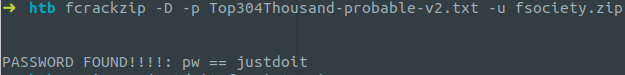
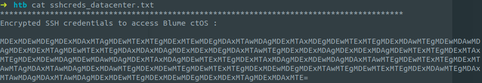
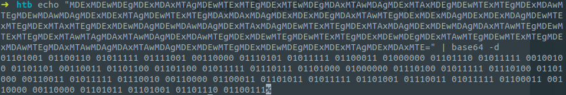
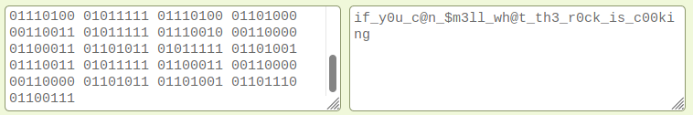

fs0ciety is yet another low-hanging fruit among the HackTheBox challenges. It's great for beginners who want to test their process for cracking password-protected zip files and recognition of various encodings.For that, we will use `fcrackzip `- simply for the reason that it has been around for ages and ships with Kali by default. I have sourced my wordlist from [here](https://github.com/berzerk0/Probable-Wordlists). Let's fire up the program:

Unzipping the file with the password `justdoit`: `unzip -P justdoit fsociety.zip`; We find an interesting file containing credentials:

The equals sign at the end is a classic indicator for base64 encoding, so we attempt to decode the text that way:

.. which leaves us with something that looks like binary-encoded ASCII characters. Decoding that online gives us the flag:

