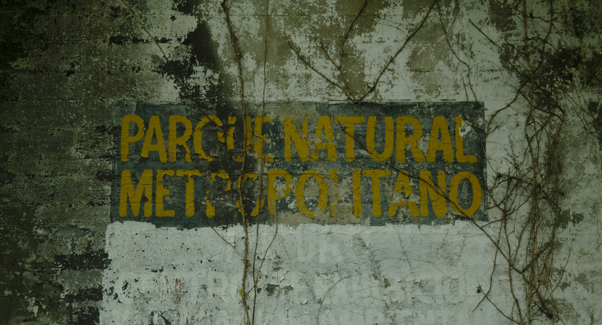
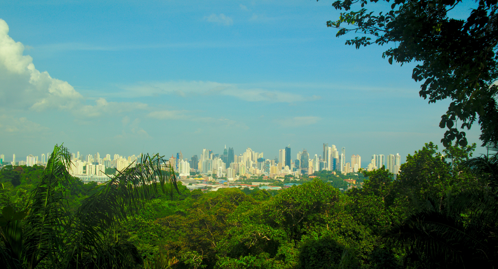
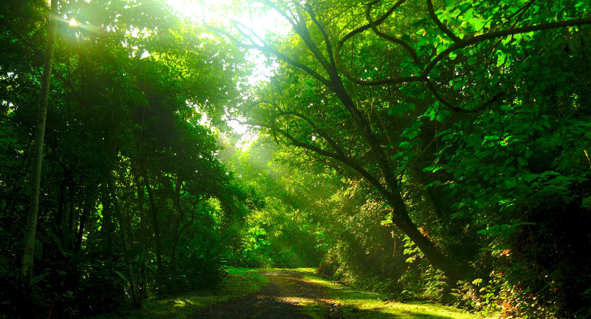
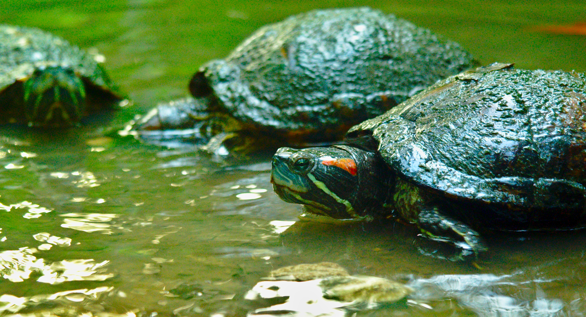

Since 1988 there is a park just on the outskirts of Panama City - *El Parque Natural Metropolitano*. It's the only wildlife refuge in the city and is host to an amazing variety of wildlife. There are no special attractions there. It's a place you just go to in a casual manner to relax and forget your everyday duties for some hours. It's fairly big and you can also easily spend a day there - as I did with some friends from the university.

From the main mountain you're able to catch a nice view on the city skyline..

..walk on to enjoy the tranquility of the forest..

..and soon-to-be forests.

Turtles.

It was a good day.
