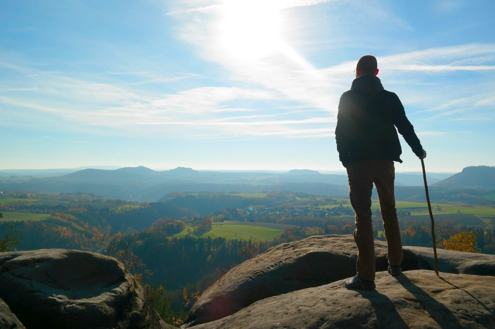
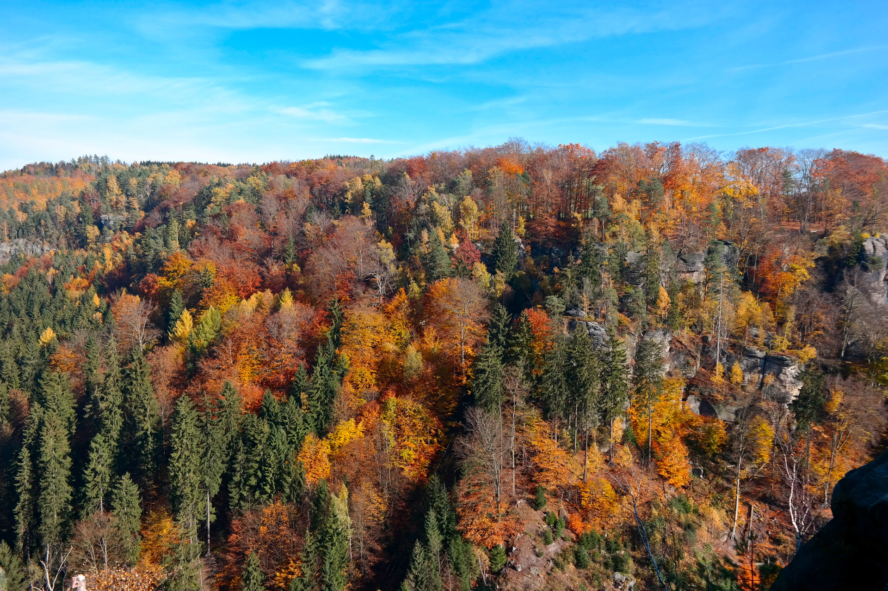
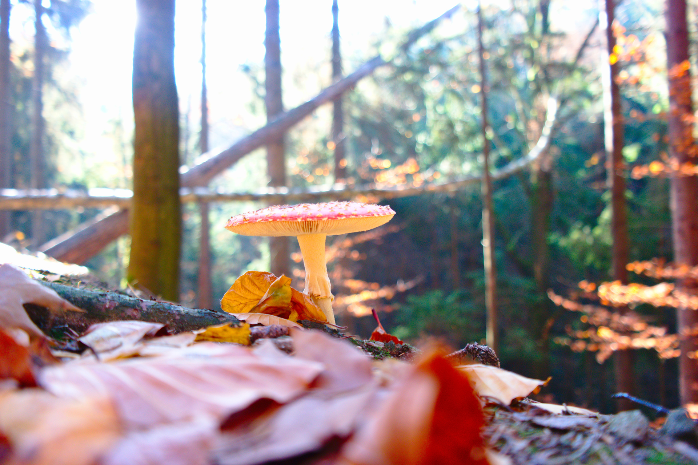

When you have the chance to study in Dresden, it's a *must* for every outdoor person to go hiking in the Saxon Switzerland. It's only ~30 minutes away from Dresden and you can get there for free with your semester ticket if you're enrolled at the local uni, Technische Universität Dresden. Whether spring, summer, autumn or winter; there are always amazing views in a landscape that seems to completely change after every corner.

There are amazing views to discover, ...

... wonderful colours to see ...

... and beautiful details to uncover.

